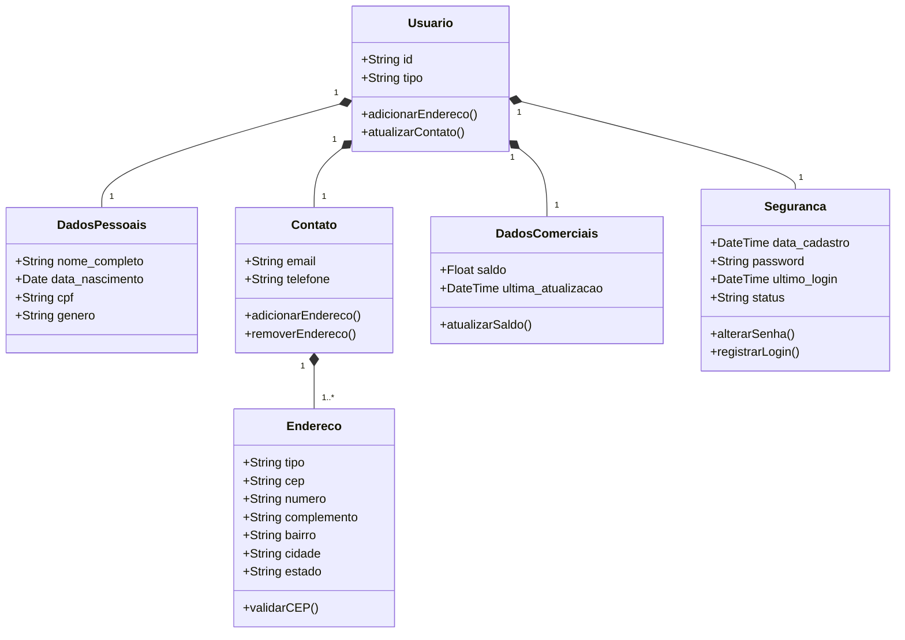
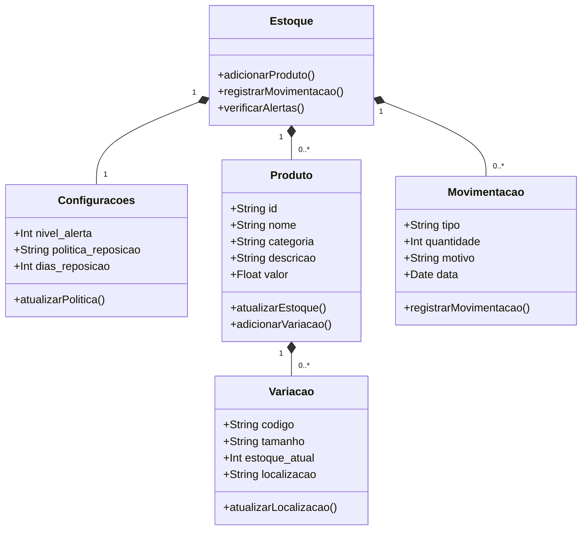

# 🎲 Happy Toys - E-commerce System

> Web Development Project for IFPE - Instituto Federal de Pernambuco

## 📌 Project Overview

Happy Toys is a complete e-commerce system for toy sales, developed as part of the web development curriculum at IFPE. The system includes:

- 👤 User management module
- 📦 Inventory control system
- 🛒 Future e-commerce features

## 🧩 System Architecture

### User Module

---

## 🛠️ Tecnologias Utilizadas

| Camada          | Tecnologias                 |
|-----------------|-----------------------------|
| **Frontend**    | HTML5, CSS3, JavaScript     |
| **Backend**     | X                           |
| **Banco de Dados** |  X                       |
| **Documentação** | X                          |
| **Versionamento** | X                         |
